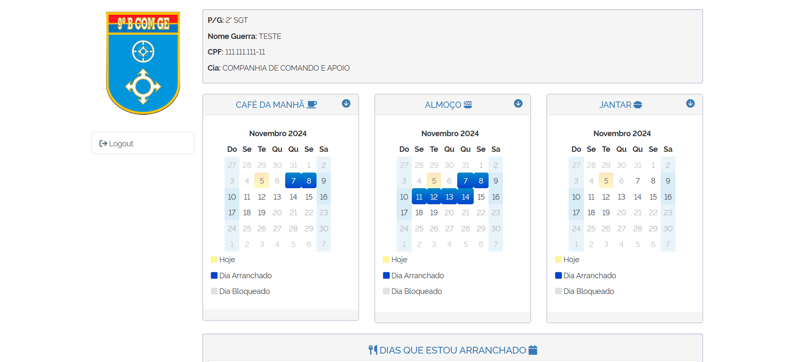

# Sistema de Arranchamento 9º B Com GE

Esse é o sistema de arranchamento utilizado no 9º B Com GE. Não foi desenvolvido por mim, apenas refatorei, apliquei algumas melhorias e dockerizei.

## Fazer deploy

### Pré-requisitos
- ter [git](https://git-scm.com/downloads) instalado
- ter [docker](https://docs.docker.com/engine/install/) instalado
- ter acesso à internet

Clonar este repositório
```
git clone https://github.com/nixoletas/sistema-arranchamento.git
```

Acessar a pasta do projeto
```
cd sistema-arranchamento
```

compose up 
```
docker compose up -d
```
- Acessar servidor em: http://localhost:8080 ou pelo IP do seu servidor

- Acessar PhpMyAdmin: http://localhost:8090

### DEMO - USUÁRIO




### DEMO - ADMIN


## Sucesso do compose ✅
```bash
 ✔ Network sistema-arranchamento_sisrancho-network  Created                                                                                                     0.1s 
 ✔ Volume "sistema-arranchamento_db_data"           Created                                                                                                     0.0s 
 ✔ Container sisrancho-db                           Started                                                                                                     0.9s 
 ✔ Container sisrancho-php                          Started                                                                                                     0.9s 
 ✔ Container sisrancho-admin                        Started
 ```

 ## Estrutura de pastas

```
└── 📁sistema-arranchamento
    └── 📁assets
        └── 📁bootstrap-datepicker
        └── 📁css
        └── 📁font-awesome
        └── 📁img
        └── 📁js
            └── app-rancho.js
            └── app.js
            └── bootstrap.js
            └── jquery.js
            └── jquery.validate-1.15.0.js
            └── mask.js
        └── 📁TCPDF
    └── 📁controllers
        └── 📁config
            └── conexao.php
        └── app.php
        └── autentica.php
        └── bloqueios.php
        └── consulta.php
        └── registros.php
    └── 📁inc
        └── footer.php
        └── header.php
        └── skeleton.php
    └── 📁rancho
        └── 📁controllers
            └── arranchar-outra-om.php
            └── arranchar.php
            └── auditoria.php
            └── autentica.php
            └── militares.php
            └── militares.php_bkp
            └── organizacao.php
            └── pesquisa-militar.php
            └── registros.php
            └── usuarios.php
        └── 📁relatorios
            └── arranchados-outra-om.php
            └── arranchados.php
        └── 📁views
            └── modals.php
        └── home.php
        └── index.php
        └── logout.php
    └── 📁views
        └── 📁home
            └── inicio.php
        └── index.php
    └── .gitignore
    └── database.sql
    └── docker-compose.yml
    └── Dockerfile
    └── index.php
    └── logout.php
```


# Estrutura do Banco de Dados


### Tabela: `cad_cia`

Armazena informações sobre as companhias (CIA) cadastradas.

- **id**: `int(11)` - Identificador único da companhia (chave primária).
- **nome**: `varchar(200)` - Nome da companhia.
- **descricao**: `varchar(500)` - Descrição da companhia.

---

### Tabela: `cad_militar`

Armazena dados de militares cadastrados.

- **id**: `int(11)` - Identificador único do militar (chave primária).
- **nome**: `varchar(200)` - Nome completo do militar.
- **nome_guerra**: `varchar(200)` - Nome de guerra do militar.
- **ident_militar**: `varchar(200)` - Identificação única militar (único).
- **posto**: `int(11)` - Referência ao posto do militar, armazenado como inteiro.
- **om_id**: `int(11)` - Identificação da organização militar (OM) associada ao militar.

---

### Tabela: `cad_posto`

Armazena os postos e graduações, assim como sua ordem hierárquica.

- **id**: `int(11)` - Identificador único do posto (chave primária).
- **tipo**: `varchar(200)` - Categoria do posto (ex: Oficiais Superiores).
- **nome**: `varchar(200)` - Nome ou abreviação do posto.
- **ordem**: `int(11)` - Ordem hierárquica do posto.

---

### Tabela: `registros`

Registra eventos relacionados aos militares.

- **id**: `bigint(20)` - Identificador único do registro (chave primária).
- **data**: `date` - Data do registro.
- **tp**: `varchar(10)` - Tipo de registro.
- **ident_militar**: `varchar(255)` - Identificação do militar associada ao registro.

---

### Tabela: `registros_outros`

Registra informações de militares de outras OM (Organizações Militares).

- **id**: `int(11)` - Identificador único (chave primária).
- **nome**: `varchar(45)` - Nome do militar.
- **ident_militar**: `varchar(45)` - Identificação militar.
- **om**: `varchar(45)` - Nome da organização militar de origem.
- **posto**: `int(11)` - Identificação do posto.
- **tpRef**: `int(11)` - Tipo de referência.
- **data**: `date` - Data do registro.

---

### Tabela: `usuarios`

Armazena informações sobre os usuários do sistema.

- **id**: `int(11)` - Identificador único do usuário (chave primária).
- **usuario**: `varchar(255)` - Nome de usuário.
- **senha**: `varchar(255)` - Hash da senha do usuário.
- **tipo**: `int(11)` - Tipo de usuário, referenciando permissões ou níveis de acesso.
- **om**: `int(11)` - Organização militar associada ao usuário.
- **nome**: `varchar(100)` - Nome completo do usuário.

--- 

Essas tabelas definem a estrutura de um banco de dados para gerenciar dados de militares, registros de eventos e informações de companhias e postos.